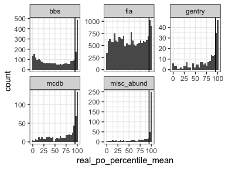

Updated results
================
Renata Diaz
2021-03-11

  - [Comparing observed to the
    baseline](#comparing-observed-to-the-baseline)
      - [Central tendency](#central-tendency)
      - [Shape metrics](#shape-metrics)

## Comparing observed to the baseline

### Central tendency

<!-- -->

<div class="kable-table">

| dat         | prop\_high\_po | nsites |
| :---------- | -------------: | -----: |
| bbs         |      0.2340426 |   2773 |
| fia         |      0.0715021 |  18447 |
| gentry      |      0.3392857 |    224 |
| mcdb        |      0.3152174 |    552 |
| misc\_abund |      0.5910931 |    494 |

</div>

<div class="kable-table">

| in\_fia        | prop\_high\_po | nsites |
| :------------- | -------------: | -----: |
| FIA            |      0.0715021 |  18447 |
| Other datasets |      0.2945832 |   4043 |

</div>

<!-- --><!-- -->

<div class="kable-table">

| real\_to\_mean\_sim\_po\_ratio\_min | real\_to\_mean\_sim\_po\_difference\_min | real\_to\_mean\_sim\_po\_ratio\_max | real\_to\_mean\_sim\_po\_difference\_max |
| ----------------------------------: | ---------------------------------------: | ----------------------------------: | ---------------------------------------: |
|                            1.546426 |                                0.0466594 |                            9.727238 |                                0.6125292 |

</div>

### Shape metrics

<!-- -->

<div class="kable-table">

| dat         |      nsng |      shan |      simp |      skew | dir  |
| :---------- | --------: | --------: | --------: | --------: | :--- |
| bbs         | 0.0796971 | 0.0100974 | 0.0176704 | 0.1301839 | HIGH |
| fia         | 0.0258472 | 0.0037909 | 0.0036186 | 0.0564618 | HIGH |
| gentry      | 0.0179372 | 0.3094170 | 0.2735426 | 0.1883408 | HIGH |
| mcdb        | 0.1682975 | 0.0097847 | 0.0097847 | 0.1663405 | HIGH |
| misc\_abund | 0.3395062 | 0.0082305 | 0.0041152 | 0.3497942 | HIGH |

</div>

<div class="kable-table">

| dat         |      nsng |      shan |      simp |      skew | dir |
| :---------- | --------: | --------: | --------: | --------: | :-- |
| bbs         | 0.0000000 | 0.2802019 | 0.2596466 | 0.0281284 | LOW |
| fia         | 0.0000000 | 0.0931648 | 0.0962665 | 0.0125790 | LOW |
| gentry      | 0.3004484 | 0.1300448 | 0.1524664 | 0.0896861 | LOW |
| mcdb        | 0.0000000 | 0.4031311 | 0.3718200 | 0.0156556 | LOW |
| misc\_abund | 0.0000000 | 0.6275720 | 0.6008230 | 0.0041152 | LOW |

</div>

<!-- ``` -->

<!-- ```{r} -->

<!-- ggplot(all_di, aes((real_po / sim_pos_from_best), real_po_percentile_excl, color =  real_po_percentile_excl > 95)) + -->

<!--   geom_point(alpha = .3)  -->

<!-- all_di %>% -->

<!--   mutate(rat = real_po / sim_pos_from_best, -->

<!--          dev = real_po_percentile_excl > 95) %>% -->

<!--   group_by(dev) %>% -->

<!--   summarize(minrat = min(rat), -->

<!--             maxrat = max(rat), -->

<!--             meanrat = mean(rat), -->

<!--             mindis = min(real_po - sim_pos_from_best), -->

<!--             maxdis = max(real_po - sim_pos_from_best)) -->

<!-- ggplot(all_di, aes(nparts, sim_pos_from_best)) + -->

<!--   geom_point() + -->

<!--   scale_x_log10() -->

<!-- ggplot(all_di, aes(nparts, sim_pos_from_best, color = dat)) + -->

<!--   geom_point() + -->

<!--   scale_x_log10()  + -->

<!--   scale_color_viridis_d() + -->

<!--   theme(legend.position = "top") -->

<!-- ggplot(all_di, aes(s0, n0, color =  sim_pos_from_best)) + -->

<!--   geom_point() + -->

<!--   scale_x_log10()  + -->

<!--   scale_y_log10() + -->

<!--   scale_color_viridis_c() + -->

<!--   theme(legend.position = "top") -->

<!-- ``` -->
