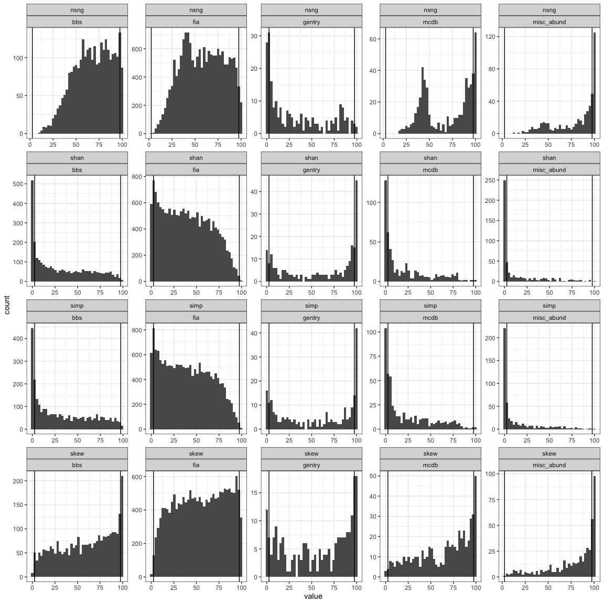
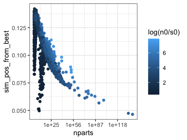
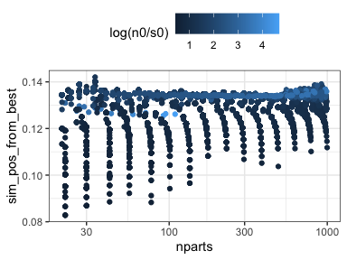
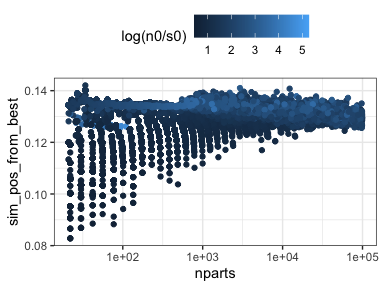
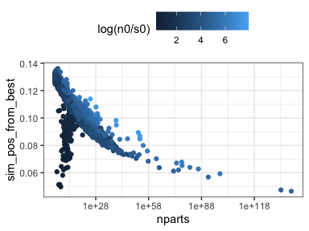
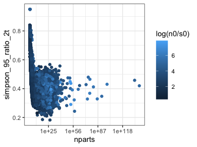
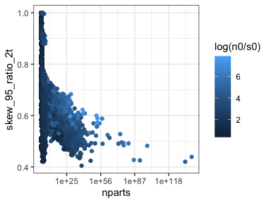
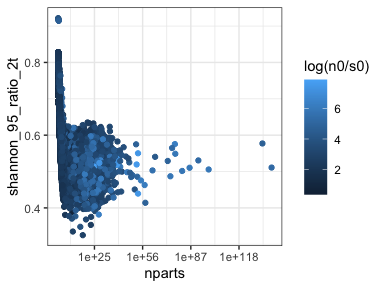
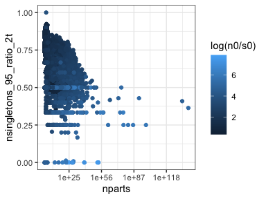

Updated results
================
Renata Diaz
2021-03-11

  - [Comparing observed to the
    baseline](#comparing-observed-to-the-baseline)
      - [Central tendency](#central-tendency)
      - [Shape metrics](#shape-metrics)
  - [Narrowness of the expectation](#narrowness-of-the-expectation)
      - [Central tendency](#central-tendency-1)
      - [Shape metric](#shape-metric)

## Comparing observed to the baseline

### Central tendency

<!-- -->

| dat         | prop\_high\_po | nsites |
| :---------- | -------------: | -----: |
| bbs         |      0.2340426 |   2773 |
| fia         |      0.0715021 |  18447 |
| gentry      |      0.3392857 |    224 |
| mcdb        |      0.3152174 |    552 |
| misc\_abund |      0.5910931 |    494 |

| in\_fia        | prop\_high\_po | nsites |
| :------------- | -------------: | -----: |
| FIA            |      0.0715021 |  18447 |
| Other datasets |      0.2945832 |   4043 |

<!-- --><!-- -->

| real\_to\_mean\_sim\_po\_ratio\_min | real\_to\_mean\_sim\_po\_difference\_min | real\_to\_mean\_sim\_po\_ratio\_max | real\_to\_mean\_sim\_po\_difference\_max |
| ----------------------------------: | ---------------------------------------: | ----------------------------------: | ---------------------------------------: |
|                            1.546426 |                                0.0466594 |                            9.727238 |                                0.6125292 |

### Shape metrics

<!-- -->

| dat                |    n |      nsng |      shan |      simp |      skew | dir  |
| :----------------- | ---: | --------: | --------: | --------: | --------: | :--- |
| bbs                | 2772 | 0.0797258 | 0.0101010 | 0.0176768 | 0.1302309 | HIGH |
| bbs\_small         |    1 | 0.0000000 | 0.0000000 | 0.0000000 | 0.0000000 | HIGH |
| fia                | 7959 | 0.0325418 | 0.0025129 | 0.0028898 | 0.0894585 | HIGH |
| fia\_small         | 9451 | 0.0202095 | 0.0048672 | 0.0042324 | 0.0286742 | HIGH |
| gentry             |  223 | 0.0179372 | 0.3094170 | 0.2735426 | 0.1883408 | HIGH |
| mcdb               |  377 | 0.2068966 | 0.0132626 | 0.0132626 | 0.2175066 | HIGH |
| mcdb\_small        |  134 | 0.0597015 | 0.0000000 | 0.0000000 | 0.0223881 | HIGH |
| misc\_abund        |  464 | 0.3534483 | 0.0086207 | 0.0043103 | 0.3599138 | HIGH |
| misc\_abund\_small |   22 | 0.0454545 | 0.0000000 | 0.0000000 | 0.1363636 | HIGH |

| dat                |      nsng |      shan |      simp |      skew | dir |
| :----------------- | --------: | --------: | --------: | --------: | :-- |
| bbs                | 0.0000000 | 0.2803030 | 0.2597403 | 0.0281385 | LOW |
| bbs\_small         | 0.0000000 | 0.0000000 | 0.0000000 | 0.0000000 | LOW |
| fia                | 0.0000000 | 0.1248901 | 0.1290363 | 0.0124387 | LOW |
| fia\_small         | 0.0000000 | 0.0664480 | 0.0686700 | 0.0126971 | LOW |
| gentry             | 0.3004484 | 0.1300448 | 0.1524664 | 0.0896861 | LOW |
| mcdb               | 0.0000000 | 0.4748011 | 0.4323607 | 0.0159151 | LOW |
| mcdb\_small        | 0.0000000 | 0.2014925 | 0.2014925 | 0.0149254 | LOW |
| misc\_abund        | 0.0000000 | 0.6508621 | 0.6228448 | 0.0043103 | LOW |
| misc\_abund\_small | 0.0000000 | 0.1363636 | 0.1363636 | 0.0000000 | LOW |

| in\_fia |      nsng |      shan |      simp |      skew | dir  |
| :------ | --------: | --------: | --------: | --------: | :--- |
| FIA     | 0.0325418 | 0.0025129 | 0.0028898 | 0.0894585 | high |
| Other   | 0.0496132 | 0.0113062 | 0.0116781 | 0.0691015 | high |

| in\_fia |      nsng |      shan |      simp |      skew | dir |
| :------ | --------: | --------: | --------: | --------: | :-- |
| FIA     | 0.0000000 | 0.0931648 | 0.0962665 | 0.0125790 | LOW |
| Other   | 0.0167794 | 0.3298272 | 0.3095417 | 0.0270473 | LOW |

## Narrowness of the expectation

### Central tendency

<!-- -->

<!-- -->

### Shape metric

<!-- --><!-- --><!-- --><!-- -->

<!-- --><!-- --><!-- --><!-- --><!-- -->

<!-- --><!-- --><!-- --><!-- --><!-- -->

    ## 
    ##  Two-sample Kolmogorov-Smirnov test
    ## 
    ## data:  simpson_ks$simpson_95_ratio_2t_FIA and simpson_ks$`simpson_95_ratio_2t_Other datasets`
    ## D = 0.039394, p-value = 0.96
    ## alternative hypothesis: two-sided

    ## 
    ##  Two-sample Kolmogorov-Smirnov test
    ## 
    ## data:  simpson_ks$simpson_percentile_FIA and simpson_ks$`simpson_percentile_Other datasets`
    ## D = 0.057576, p-value = 0.6447
    ## alternative hypothesis: two-sided

    ## 
    ##  Two-sample Kolmogorov-Smirnov test
    ## 
    ## data:  skewness_ks$skew_95_ratio_2t_FIA and skewness_ks$`skew_95_ratio_2t_Other datasets`
    ## D = 0.033333, p-value = 0.993
    ## alternative hypothesis: two-sided

    ## 
    ##  Two-sample Kolmogorov-Smirnov test
    ## 
    ## data:  skewness_ks$skew_percentile_excl_FIA and skewness_ks$`skew_percentile_excl_Other datasets`
    ## D = 0.09697, p-value = 0.08982
    ## alternative hypothesis: two-sided

<!-- --><!-- --><!-- --><!-- --><!-- --><!-- --><!-- --><!-- --><!-- --><!-- -->

<!-- --><!-- --><!-- --><!-- -->

<!-- -->
