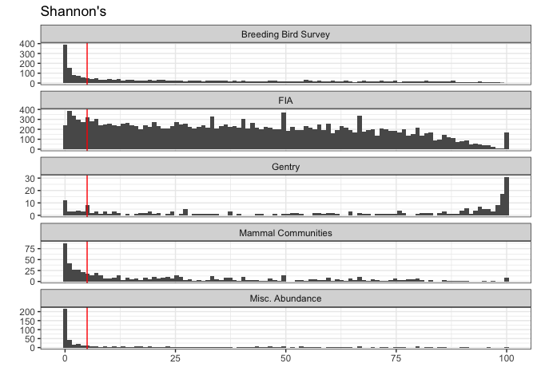
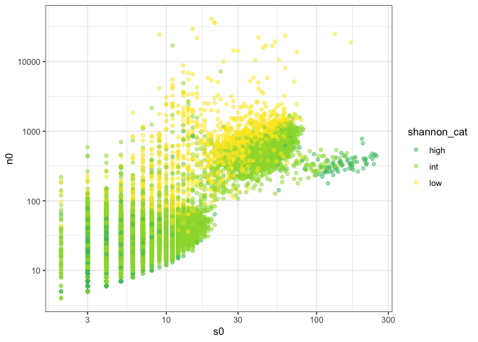
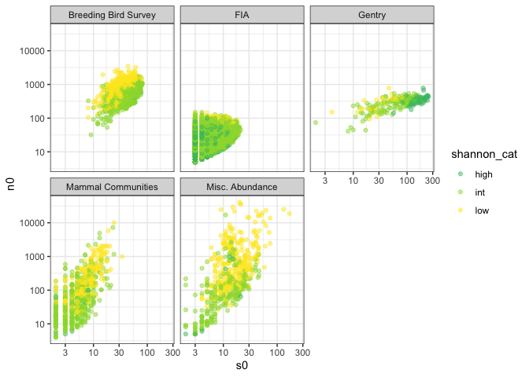

Shannon diversity
================
Renata Diaz
2021-02-13

<!-- -->

    ## `summarise()` ungrouping output (override with `.groups` argument)

| Dataset              | proportion\_shannon\_low | nsites\_even |
| :------------------- | -----------------------: | -----------: |
| Breeding Bird Survey |                0.2802019 |         2773 |
| FIA                  |                0.0822637 |        20179 |
| Gentry               |                0.1294643 |          224 |
| Mammal Communities   |                0.3115727 |          674 |
| Misc. Abundance      |                0.5658627 |          539 |

    ## `summarise()` ungrouping output (override with `.groups` argument)

| Dataset              | proportion\_shannon\_low | proportion\_shannon\_high | nsites\_even |
| :------------------- | -----------------------: | ------------------------: | -----------: |
| Breeding Bird Survey |                0.2802019 |                 0.0100974 |         2773 |
| FIA                  |                0.0822637 |                 0.0129838 |        20179 |
| Gentry               |                0.1294643 |                 0.3080357 |          224 |
| Mammal Communities   |                0.3115727 |                 0.0163205 |          674 |
| Misc. Abundance      |                0.5658627 |                 0.0129870 |          539 |

This is really interesting.

  - Shannon’s is consistently low for most of the datasets. As with
    skewness and evenness, FIA has the lowest % of extremes.
  - However, Gentry is actually more pronouncedly too **high** - 30% of
    sites are above the 95th.

<!-- --><!-- -->

The ones that come out as high are concentrated in the small region of
FIA and the region of Gentry where N is closest to S. These Gentry plots
are also responsible for similar behavior (not discussed in the main ms)
in the other metrics.

That is, for these datasets where N/S is relatively small, the observed
SADs are tending to be more even than the feasible set.
